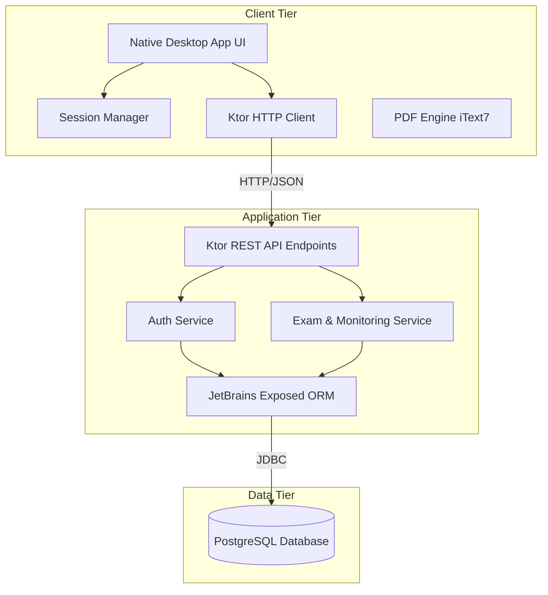
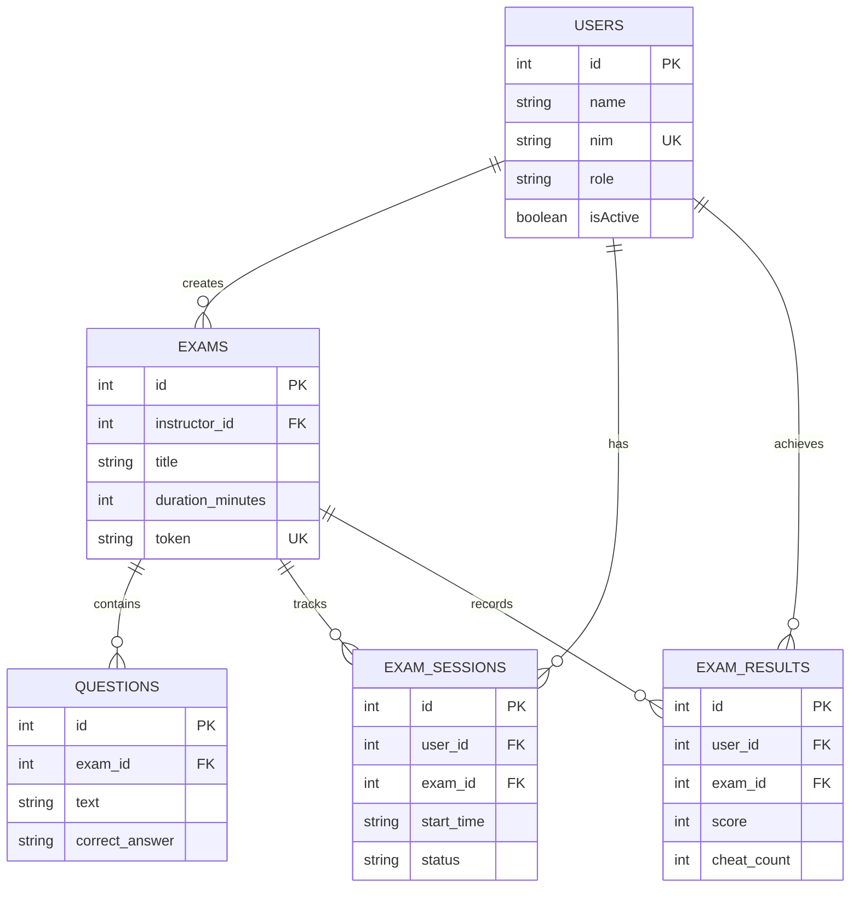
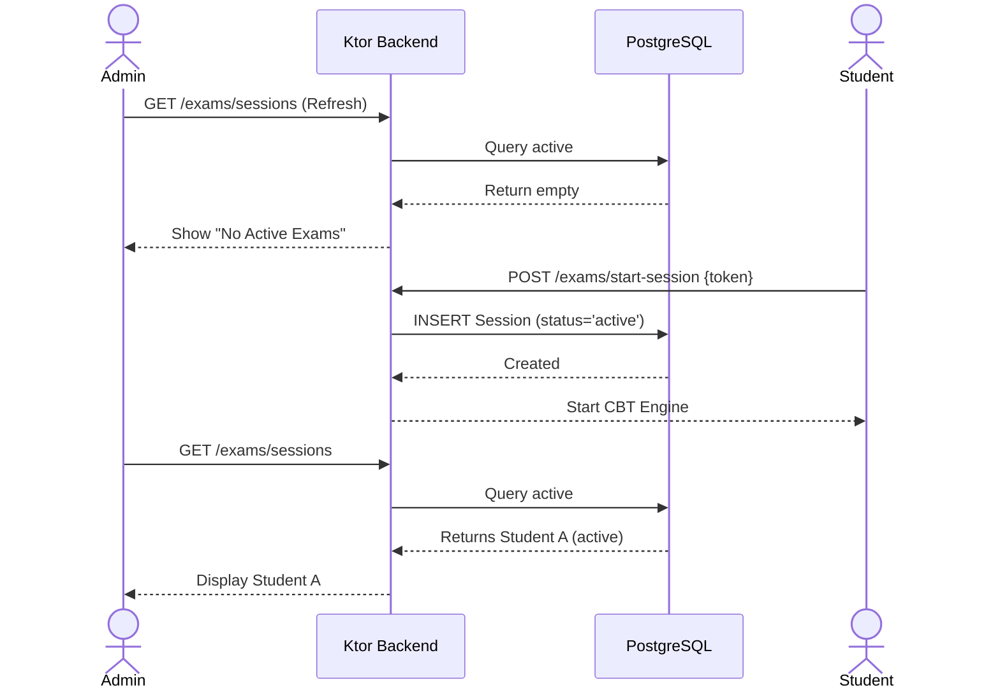
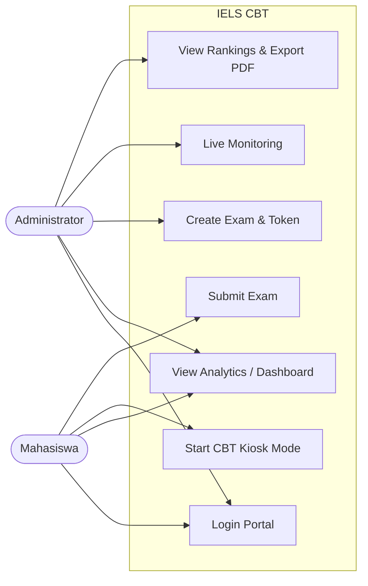
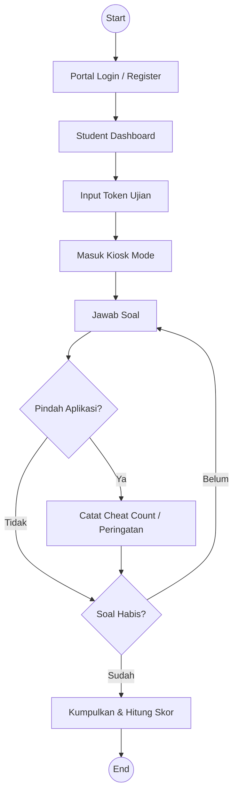

<div align="center">
  <h1>IELS Secure CBT Platform</h1>
  <p><strong>Platform Ujian Berbasis Komputer Tingkat Lanjut untuk Fakultas Teknik Universitas Sam Ratulangi</strong></p>

  [](https://kotlinlang.org/)
  [](https://www.jetbrains.com/lp/compose-multiplatform/)
  [](https://ktor.io/)
  [](https://www.postgresql.org/)
  [](https://www.docker.com/)
</div>

<br/>

IELS Secure CBT (Computer-Based Test) adalah sistem manajemen ujian modern yang dirancang secara khusus untuk memenuhi standar akademik di Fakultas Teknik Universitas Sam Ratulangi (Fatek UNSRAT). Platform ini memisahkan arsitektur *Backend* dan *Frontend* untuk menghadirkan performa tinggi, keamanan maksimal, dan pengalaman pengguna (*User Experience*) tingkat korporasi.

## Arsitektur Sistem

Proyek ini dibangun menggunakan arsitektur *Client-Server* modern:

*   **`iels-backend/`** : REST API berkinerja tinggi yang dibangun menggunakan Ktor (Netty) dan JetBrains Exposed ORM. Terhubung secara langsung dengan *database* terpusat (PostgreSQL).
*   **`iels-kotlin/`** : Aplikasi *Native Desktop* (Frontend) yang dibangun menggunakan Jetpack Compose Multiplatform. Dirancang untuk antarmuka Admin (Pengelolaan Ujian) dan Portal Mahasiswa.

## Fitur Utama

### Untuk Administrator & Instruktur
*    **Live Exam Monitoring**: Pantau aktivitas mahasiswa yang sedang melangsungkan ujian secara *real-time*.
*    **Visual Analytics**: Dashboard interaktif yang menyajikan grafik persentase rata-rata kelulusan secara otomatis.
*    **Automated Grading & Ranking**: Sistem penilaian otomatis yang langsung menyusun peringkat skor mahasiswa begitu ujian selesai.
*    **Corporate PDF Export**: Hasilkan rekapitulasi nilai ujian lengkap dengan kop surat institusi menggunakan *engine* iText7.

### Untuk Mahasiswa
*    **Secure Token Access**: Akses ujian diamankan menggunakan sistem token otentikasi.
*    **Kiosk Mode**: Antarmuka ujian mendukung mode layar penuh (*Fullscreen*) untuk meminimalisir gangguan selama pengerjaan.

## Visualisasi & Arsitektur Sistem

<details>
<summary><strong>1. Arsitektur Sistem (Client-Server)</strong></summary>


</details>

<details>
<summary><strong>2. Skema Database (Entity Relationship)</strong></summary>


</details>

<details>
<summary><strong>3. Sequence Diagram: Live Monitoring & CBT Flow</strong></summary>


</details>

<details>
<summary><strong>4. Use Case Diagram</strong></summary>


</details>

<details>
<summary><strong>5. Activity Diagram (CBT Engine Flow)</strong></summary>


</details>

## Panduan Instalasi & Menjalankan

### Persyaratan Sistem
*   Java Development Kit (JDK) 17 atau lebih baru
*   Docker & Docker Compose (Untuk Database PostgreSQL)

### 1. Menjalankan Database
Pastikan layanan Docker sudah berjalan, lalu jalankan perintah ini di root repositori untuk menghidupkan basis data:
```bash
docker-compose up -d
```

### 2. Menjalankan Backend (API Server)
Buka terminal baru dan arahkan ke direktori backend:
```bash
cd iels-backend
./gradlew run
```
*Server API Ktor akan beroperasi pada alamat `http://localhost:8081`.*

### 3. Menjalankan Frontend (Aplikasi Desktop)
Buka terminal lain dan jalankan klien Compose Desktop:
```bash
cd iels-kotlin
./gradlew run
```

## Teknologi Pendukung Terkini

*   **Bahasa Pemrograman**: Kotlin 2.0.0
*   **Antarmuka Pengguna**: Compose Desktop 1.6.11
*   **Kerangka Kerja API**: Ktor 2.3.0
*   **ORM Database**: JetBrains Exposed 0.49.0
*   **Keamanan**: jBcrypt (Password Hashing)
*   **Pemrosesan Dokumen**: iText7 Core

---
<div align="center">
  <p>Dikembangkan dengan dedikasi untuk keunggulan akademik <strong>Fakultas Teknik Universitas Sam Ratulangi</strong>.</p>
</div>
