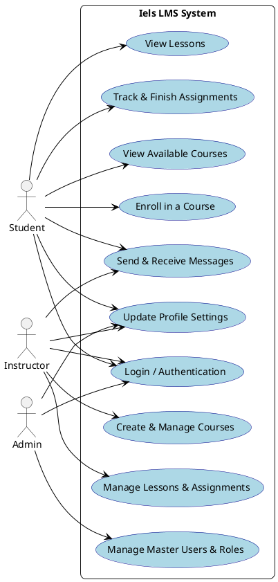
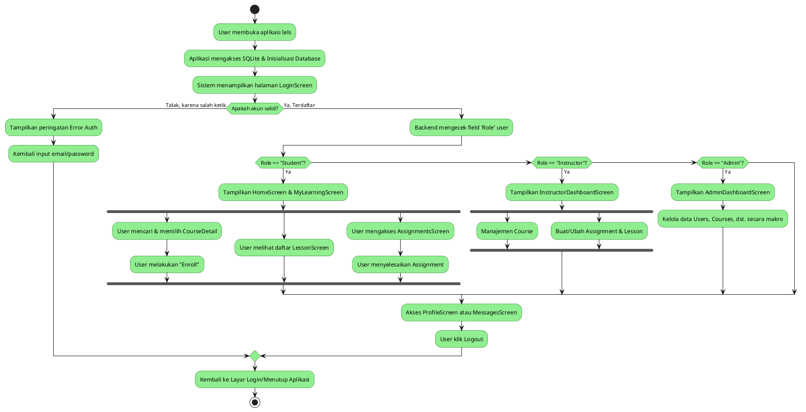

# PROPOSAL APLIKASI IELS

## 1. Cover
**Judul Aplikasi:** Iels - Desktop-based Learning Management System
**Platform:** Aplikasi Desktop (Kotlin Compose for Desktop)
**Oleh:** [Nama Kelompok / Anggota Kelompok Anda]

---

## 2. Deskripsi Aplikasi

**Latar Belakang:**
Dalam era digitalisasi pendidikan, baik instansi pendidikan formal maupun lembaga kursus membutuhkan sistem manajemen pembelajaran (*Learning Management System*/LMS) yang cepat, responsif, dan mudah digunakan. Banyak LMS yang berbasis web dan sangat bergantung pada kualitas koneksi internet. Iels hadir sebagai solusi LMS berbasis desktop (dibangun dengan performa tinggi menggunakan bahasa Kotlin dan Compose Desktop) yang menawarkan kecepatan akses lokal, antarmuka modern yang mulus (smooth), dan pengelolaan basis data SQLite lokal untuk mendukung pengalaman belajar mengajar tanpa kendala *lag*.

**Tujuan Utama:**
Menyediakan *platform* manajemen pembelajaran berbasis desktop yang terpadu bagi pengajar dan siswa untuk melakukan proses registrasi kelas, penyampaian materi (lessons), hingga pemberian dan pengerjaan tugas (assignments) dalam satu *environment* antarmuka.

**Manfaat Kehadiran Iels:**
- **Bagi Pengajar:** Memudahkan pengelolaan materi, penugasan, dan pemantauan interaksi kelas dari satu *dashboard* tanpa pusing mengurus infrastruktur web yang kompleks.
- **Bagi Siswa:** Mendapatkan lingkungan belajar terpusat agar mudah melihat progres materi yang diambil, jadwal tugas yang menanti (*deadlines*), dan berkomunikasi.
- **Bagi Instansi:** Memiliki sistem manajemen pendidikan terpadu yang efisien, handal, dan *cost-effective* berkat basis desktop terlokalisasi.

**Fitur Secara Umum:**
1. **Multi-Role Authentication:** Sistem login dengan keamanan *password hashing* bcrypt, serta otorisasi yang membedakan tampilan bagi Admin, Instruktur (Pengajar), dan Siswa.
2. **Dashboard yang Interaktif:** Setiap jenis *user* memiliki *dashboard* sendiri (Admin Dashboard, Instructor Dashboard, HomeScreen untuk Siswa).
3. **Course & Lesson Management:** Pengajar bebas membuat modul terstruktur (kelas dan rincian materinya).
4. **Assignment Tracking:** Mencatat penugasan yang masuk maupun memantau penugasan yang sudah diselesaikan (ditandai `is_done`).
5. **Messaging / Diskusi:** Memfasilitasi jalur komunikasi antar pengguna.
6. **Account & Profile Settings:** Pengaturan profil spesifik diintegrasikan di layar antarmuka terpisah.

---

## 3. Users (Aktor)
Iels dirancang dengan 3 (tiga) peran pengguna utama. Masing-masing memiliki batasan wewenang dan alur navigasi yang spesifik.

1. **Student (Siswa):**
   - **Deskripsi:** Pengguna yang menggunakan Iels untuk mengonsumsi materi pembelajaran.
   - **Peran:** Dapat mendaftar (*enroll*) ke dalam *course* yang tersedia, mengakses materi (*lessons*), melihat status penugasan (*assignments*), memperbarui profil, dan berkomunikasi lewat fitur pesan.
2. **Instructor (Pengajar/Dosen):**
   - **Deskripsi:** Pengguna yang menjadi kreator konten pembelajaran.
   - **Peran:** Dapat membuat, mengubah, dan menghapus *course* maupun *assignment*. Mereka bertugas untuk mengawasi interaksi kelas dan menilai atau memantau kemajuan.
3. **Admin:**
   - **Deskripsi:** Pengelola penuh atas sistem aplikasi.
   - **Peran:** Berwenang penuh untuk melakukan moderasi data, kelola semua akun (Users), dan menyelesaikan isu administratif di tingkat atas (melalui Admin Dashboard).

### Diagram Use Case (PlantUML)

---

## 4. Workflow Aplikasi
Workflow menggambarkan secara umum bagaimana jalannya aplikasi ketika pertama kali dihidupkan (*run*) dan merespon jenis aktor yang masuk ke dalam sistem. Alurnya secara kronologis adalah: Splash/Load -> Login -> Pengecekan Role -> Masuk ke Tampilan Khusus Role -> Interaksi Modul Utama -> Logout.

### Diagram Aktivitas (PlantUML)

---

## 5. Rancangan Antarmuka (UI/Wireframe Description)
Iels menggunakan teknologi *Material 3 Design* pada Compose Desktop, yang menjamin tampilannya modern, bersih (clean), dan estetik. Model kerangka/wireframe utamanya disajikan lewat pola hierarki berikut:

1. **Screen Login:** 
   Berisi dua kolom isian teks (Email dan Password) yang mengarah ke bagian tengah (*center alignment*) dengan tombol Login mencolok. 
2. **Top Navigation Bar:**
   Sebuah *header* (Top App Bar) mendatar di atas aplikasi, berfungsi untuk menampilkan informasi halaman aktif (misalnya: "Dashboard", "My Learning", "Settings"), ikon lonceng untuk notifikasi, dan foto kecil/avatar profil di pojok kanan atas.
3. **Menu Navigasi Samping (Sidebar / Navigation Rail):**
   Panel di sisi sebelah kiri *(left pane)* yang menetap dengan ikon dan teks menu. Terdiri dari *Home, My Learning, Courses, Assignments, Messages,* hingga *Help* dan *Account Settings*. Ini sangat mempercepat perpindahan antar modul secara instan.
4. **Main Content Area (Konten Utama):**
   Sisi sebelah kanan (yang memakan sekitar 80% lebar layar). 
   - Pada **Home**, memuat elemen visual Card (kartu) untuk *Course* terbaru atau pengingat *Deadline Assignment*.
   - Pada **Lesson Screen**, dibagi kembali menjadi *layout* detail materi yang rapi dengan indikator persentase pembelajaran.
   - Pada **Settings Screen**, berbentuk struktur vertikal (*list*) memuat tombol-tombol fungsionalitas pengubahan profil, email, sandi, dsb.
